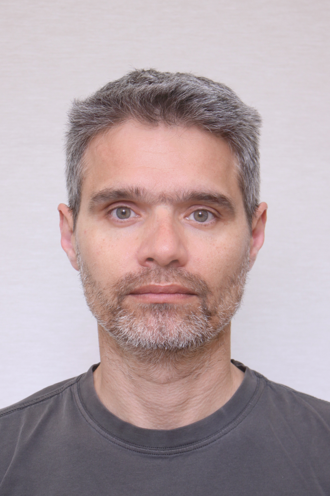

# Alexandros Dilaveris 
Computer scientist, Dental technician, Teacher.

## Currently

Doing a million things.

## Education

Greek Open University, Informatics

Dental Lab Technician School, Athens and Heraklion

## Occupation
Dental Lab owner

IT Support

Educational Robotics Teacher and Coach

Teacher at Rethymnon Institute of Vocational Training (Ινστιτούτο Επαγγελματικής Κατάρτισης)

### Specialized in

Movable and Immovable prosthesis

IT Troubleshooting

IT Support

### Languages
Greek (Native)

English (C2)

Italian (B2)

<!--
### Research interests

Cooling, power series, optics, alchemy, planetary motions, apples.

<!--
### Hi there 👋
😎 I’m currently learning how to use GitHub

- 🔭 I’m currently working on 3D_animation

**Maurphal/Maurphal** is a ✨ _special_ ✨ repository because its `README.md` (this file) appears on your GitHub profile.

Here are some ideas to get you started:

- 🔭 I’m currently working on ...
- 🌱 I’m currently learning ...
- 👯 I’m looking to collaborate on ...
- 🤔 I’m looking for help with ...
- 💬 Ask me about ...
- 📫 How to reach me: ...
- 😄 Pronouns: ...
- ⚡ Fun fact: ...
-->
